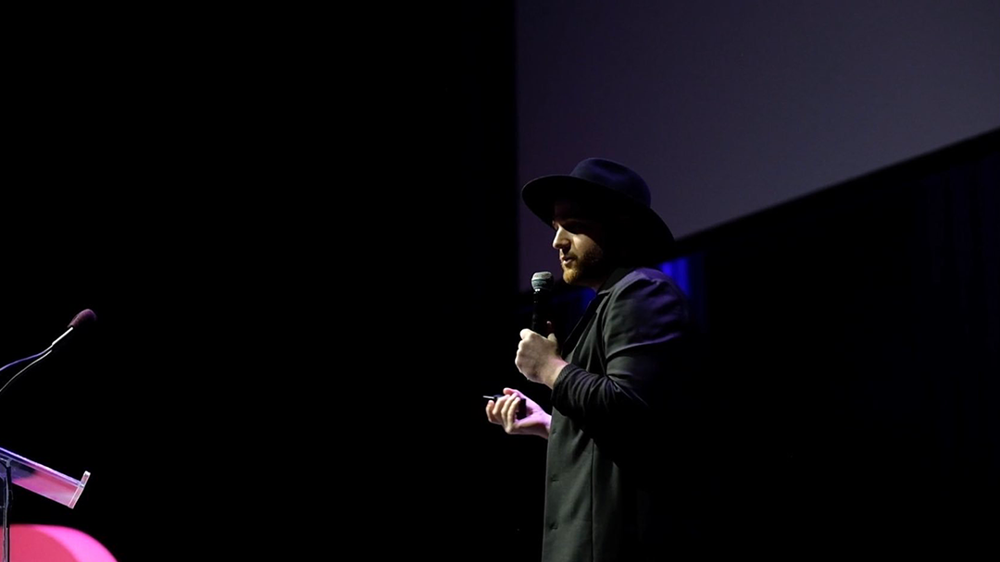

  <article class="c-grid__half-item c-text-format">
    <h2>Thinking in systems</h2>
    
I’m an experienced product designer, responsible for leading the design process on product teams, defining product direction, prioritizing company efforts, and shaping new practices within design teams.

    
As a design generalist, I use a breadth of skills to contribute to the entire product lifecycle — research, ideation, journey mapping, visual &amp; interaction design, prototyping, measuring success, and product marketing.

    
I care about why we build things, and the effects of technology on society. It’s our job to consider the technical, product, and business impact of every decision we make, and ensure that what’s built is ethical, inclusive, and accessible for anybody to use.

    
Building successful products is a team sport. It requires healthy collaboration, persistent communication, and diversity in people and ideas.

    <h2>New opportunities</h2>
    
I’m currently building a few things of my own, while seeking a new full-time role. <strong>I’m interested in tools, climate, transportation, films, music, and health care.</strong> Previously, I built tools for design teams at <a href="https://www.invisionapp.com/">InVision</a>, designed enterprise software at <a href="https://www.ibm.com/design/">IBM</a>, and prototyped apps for people at work with <a href="https://www.apple.com/business/" target="_blank">Apple</a>. In 2014, I founded the <a href="https://www.instagram.com/make.lab/">Make Lab</a> with a co-worker in Austin, TX.

    
I get inspired by meeting new people. If you find yourself in one of the five boroughs and would like to meet up for a tea, coffee, or snack, please <a href="https://twitter.com/matthewcpaul" target="_blank">reach out on Twitter</a>!

  </article>
  <figure class="c-grid__half-item c-grid__mt">
    <picture>
      <source media="(min-width: 68.5rem)" srcset="../images/about/matthewpaul-hangtime-lg.png" />
      <source media="(min-width: 32em)" srcset="../images/about/matthewpaul-hangtime-md.png" />
      
    </picture>
    <figcaption>
      Keynote talk, Dribbble Hangtime NYC.
    </figcaption>
  </figure>

