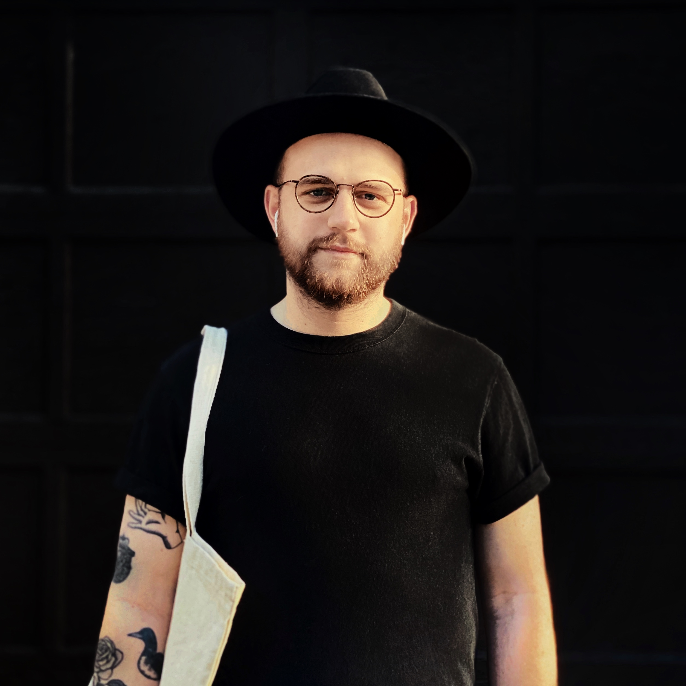

<figure>
  <picture>
    <source media="(min-width: 48em)" srcset="../images/about/matthew-paul-nyc-lg.jpg" />
  	<source media="(min-width: 32em)" srcset="../images/about/matthew-paul-nyc-md.jpg" />
  	
  </picture>
  <figcaption>
    It me, in NYC.
  </figcaption>
</figure>

## Good people
{:class="content-padding"}

Hello fellow internet traveler! I’m a software product designer, researcher, and front-end engineer, currently living in NYC.
{:class="content-padding"}

Right now I’m building a few things of my own—one OSS project around sensible screen-based media type scales, and two physical products that will be for sale this Summer/Fall. I most recently worked with <a href="https://www.invisionapp.com/">InVision</a>, <a href="https://www.ibm.com/design/">IBM</a>, and <a href="https://www.apple.com/business/">Apple at Work</a> before that.
{:class="content-padding"}

I enjoy working with good people and forming honest relationships. If you’d like to work together, meet up for a snack, or chat on the internet, please [reach out on Twitter](https://twitter.com/matthewcpaul)!
{:class="content-padding"}